# App of Apps of Apps

Three applications, each deployed across four clusters. Each application has its own Argo CD instance, and each Argo CD instance manages its own set of applications. The root Application in the management cluster orchestrates the deployment of these applications across the clusters.

```mermaid
flowchart LR
    %% Cluster and namespace groupings as subgraphs
    subgraph ManagementCluster["Management Cluster"]
      subgraph PlatformGitOps["ns:platform-gitops"]
        ArgoCDPlatformGitOps(("Platform Argo CD Instance"))
        RootApp["Root Application"]
        MsgParentAppDTE["Messaging Parent Application"]
        MsgParentAppDTW["Messaging Parent Application"]
        MsgParentAppPE["Messaging Parent Application"]
        MsgParentAppPW["Messaging Parent Application"]
        CollabParentAppDTE["Collab Board Parent Application"]
        CollabParentAppDTW["Collab Board Parent Application"]
        CollabParentAppPE["Collab Board Parent Application"]
        CollabParentAppPW["Collab Board Parent Application"]
        CaseParentAppDTE["Case Management Parent Application"]
        CaseParentAppDTW["Case Management Parent Application"]
        CaseParentAppPE["Case Management Parent Application"]
        CaseParentAppPW["Case Management Parent Application"]
        RootApp --> MsgParentAppDTE
        RootApp --> MsgParentAppDTW
        RootApp --> MsgParentAppPE
        RootApp --> MsgParentAppPW
        RootApp --> CollabParentAppDTE
        RootApp --> CollabParentAppDTW
        RootApp --> CollabParentAppPE
        RootApp --> CollabParentAppPW
        RootApp --> CaseParentAppDTE
        RootApp --> CaseParentAppDTW
        RootApp --> CaseParentAppPE
        RootApp --> CaseParentAppPW
      end
    end

    subgraph DevTestEast["devtest-east cluster"]
      subgraph MsgGitOpsNS["ns:messaging-gitops"]
        ArgoCDMsgGitOpsNS(("Argo CD Instance"))
        MsgChildApp["Child App-of-Apps Application"]
        MsgActualAppA["Messaging Application A"]
        MsgActualAppB["Messaging Application B"]
        MsgChildApp --> MsgActualAppA
        MsgChildApp --> MsgActualAppB
      end
      subgraph MsgNSA["ns:messaging"]
        MsgResourcesA["All Resources for Messaging Application A"]
      end
      subgraph MsgNSB["ns:messaging"]
        MsgResourcesB["All Resources for Messaging Application B"]
      end
      MsgActualAppA --> MsgResourcesA
      MsgActualAppB --> MsgResourcesB

      subgraph CollabGitOpsNS["ns:collab-board-gitops"]
        ArgoCDCollabGitOpsNS(("Argo CD Instance"))
        CollabChildApp["Child App-of-Apps Application"]
        CollabActualAppA["Collab Board Application A"]
        CollabActualAppB["Collab Board Application B"]
        CollabChildApp --> CollabActualAppA
        CollabChildApp --> CollabActualAppB
      end
      subgraph CollabNSA["ns:collab-board"]
        CollabResourcesA["All Resources for Collab Board Application A"]
      end
      subgraph CollabNSB["ns:collab-board"]
        CollabResourcesB["All Resources for Collab Board Application B"]
      end
      CollabActualAppA --> CollabResourcesA
      CollabActualAppB --> CollabResourcesB

      subgraph CaseGitOpsNS["ns:case-management-gitops"]
        ArgoCDCaseGitOpsNS(("Argo CD Instance"))
        CaseChildApp["Child App-of-Apps Application"]
        CaseActualAppA["Case Management Application A"]
        CaseActualAppB["Case Management Application B"]
        CaseChildApp --> CaseActualAppA
        CaseChildApp --> CaseActualAppB
      end
      subgraph CaseNSA["ns:case-management"]
        CaseResourcesA["All Resources for Case Management Application A"]
      end
      subgraph CaseNSB["ns:case-management"]
        CaseResourcesB["All Resources for Case Management Application B"]
      end
      CaseActualAppA --> CaseResourcesA
      CaseActualAppB --> CaseResourcesB
    end

    subgraph DevTestWest["devtest-west cluster"]
      subgraph MsgGitOpsNS2["ns:messaging-gitops"]
        ArgoCDMsgGitOpsNS2(("Argo CD Instance"))
        MsgChildApp2["Child App-of-Apps Application"]
        MsgActualApp2A["Messaging Application A"]
        MsgActualApp2B["Messaging Application B"]
        MsgChildApp2 --> MsgActualApp2A
        MsgChildApp2 --> MsgActualApp2B
      end
      subgraph MsgNS2A["ns:messaging"]
        MsgResources2A["All Resources for Messaging Application A"]
      end
      subgraph MsgNS2B["ns:messaging"]
        MsgResources2B["All Resources for Messaging Application B"]
      end
      MsgActualApp2A --> MsgResources2A
      MsgActualApp2B --> MsgResources2B

      subgraph CollabGitOpsNS2["ns:collab-board-gitops"]
        ArgoCDCollabGitOpsNS2(("Argo CD Instance"))
        CollabChildApp2["Child App-of-Apps Application"]
        CollabActualApp2A["Collab Board Application A"]
        CollabActualApp2B["Collab Board Application B"]
        CollabChildApp2 --> CollabActualApp2A
        CollabChildApp2 --> CollabActualApp2B
      end
      subgraph CollabNS2A["ns:collab-board"]
        CollabResources2A["All Resources for Collab Board Application A"]
      end
      subgraph CollabNS2B["ns:collab-board"]
        CollabResources2B["All Resources for Collab Board Application B"]
      end
      CollabActualApp2A --> CollabResources2A
      CollabActualApp2B --> CollabResources2B

      subgraph CaseGitOpsNS2["ns:case-management-gitops"]
        ArgoCDCaseGitOpsNS2(("Argo CD Instance"))
        CaseChildApp2["Child App-of-Apps Application"]
        CaseActualApp2A["Case Management Application A"]
        CaseActualApp2B["Case Management Application B"]
        CaseChildApp2 --> CaseActualApp2A
        CaseChildApp2 --> CaseActualApp2B
      end
      subgraph CaseNS2A["ns:case-management"]
        CaseResources2A["All Resources for Case Management Application A"]
      end
      subgraph CaseNS2B["ns:case-management"]
        CaseResources2B["All Resources for Case Management Application B"]
      end
      CaseActualApp2A --> CaseResources2A
      CaseActualApp2B --> CaseResources2B
    end

    subgraph ProdEast["prod-east cluster"]
      subgraph MsgGitOpsNS3["ns:messaging-gitops"]
        ArgoCDMsgGitOpsNS3(("Argo CD Instance"))
        MsgChildApp3["Child App-of-Apps Application"]
        MsgActualApp3A["Messaging Application A"]
        MsgActualApp3B["Messaging Application B"]
        MsgChildApp3 --> MsgActualApp3A
        MsgChildApp3 --> MsgActualApp3B
      end
      subgraph MsgNS3A["ns:messaging"]
        MsgResources3A["All Resources for Messaging Application A"]
      end
      subgraph MsgNS3B["ns:messaging"]
        MsgResources3B["All Resources for Messaging Application B"]
      end
      MsgActualApp3A --> MsgResources3A
      MsgActualApp3B --> MsgResources3B

      subgraph CollabGitOpsNS3["ns:collab-board-gitops"]
        ArgoCDCollabGitOpsNS3(("Argo CD Instance"))
        CollabChildApp3["Child App-of-Apps Application"]
        CollabActualApp3A["Collab Board Application A"]
        CollabActualApp3B["Collab Board Application B"]
        CollabChildApp3 --> CollabActualApp3A
        CollabChildApp3 --> CollabActualApp3B
      end
      subgraph CollabNS3A["ns:collab-board"]
        CollabResources3A["All Resources for Collab Board Application A"]
      end
      subgraph CollabNS3B["ns:collab-board"]
        CollabResources3B["All Resources for Collab Board Application B"]
      end
      CollabActualApp3A --> CollabResources3A
      CollabActualApp3B --> CollabResources3B

      subgraph CaseGitOpsNS3["ns:case-management-gitops"]
        ArgoCDCaseGitOpsNS3(("Argo CD Instance"))
        CaseChildApp3["Child App-of-Apps Application"]
        CaseActualApp3A["Case Management Application A"]
        CaseActualApp3B["Case Management Application B"]
        CaseChildApp3 --> CaseActualApp3A
        CaseChildApp3 --> CaseActualApp3B
      end
      subgraph CaseNS3A["ns:case-management"]
        CaseResources3A["All Resources for Case Management Application A"]
      end
      subgraph CaseNS3B["ns:case-management"]
        CaseResources3B["All Resources for Case Management Application B"]
      end
      CaseActualApp3A --> CaseResources3A
      CaseActualApp3B --> CaseResources3B
    end

    subgraph ProdWest["prod-west cluster"]
      subgraph MsgGitOpsNS4["ns:messaging-gitops"]
        ArgoCDMsgGitOpsNS4(("Argo CD Instance"))
        MsgChildApp4["Child App-of-Apps Application"]
        MsgActualApp4A["Messaging Application A"]
        MsgActualApp4B["Messaging Application B"]
        MsgChildApp4 --> MsgActualApp4A
        MsgChildApp4 --> MsgActualApp4B
      end
      subgraph MsgNS4A["ns:messaging"]
        MsgResources4A["All Resources for Messaging Application A"]
      end
      subgraph MsgNS4B["ns:messaging"]
        MsgResources4B["All Resources for Messaging Application B"]
      end
      MsgActualApp4A --> MsgResources4A
      MsgActualApp4B --> MsgResources4B

      subgraph CollabGitOpsNS4["ns:collab-board-gitops"]
        ArgoCDCollabGitOpsNS4(("Argo CD Instance"))
        CollabChildApp4["Child App-of-Apps Application"]
        CollabActualApp4A["Collab Board Application A"]
        CollabActualApp4B["Collab Board Application B"]
        CollabChildApp4 --> CollabActualApp4A
        CollabChildApp4 --> CollabActualApp4B
      end
      subgraph CollabNS4A["ns:collab-board"]
        CollabResources4A["All Resources for Collab Board Application A"]
      end
      subgraph CollabNS4B["ns:collab-board"]
        CollabResources4B["All Resources for Collab Board Application B"]
      end
      CollabActualApp4A --> CollabResources4A
      CollabActualApp4B --> CollabResources4B

      subgraph CaseGitOpsNS4["ns:case-management-gitops"]
        ArgoCDCaseGitOpsNS4(("Argo CD Instance"))
        CaseChildApp4["Child App-of-Apps Application"]
        CaseActualApp4A["Case Management Application A"]
        CaseActualApp4B["Case Management Application B"]
        CaseChildApp4 --> CaseActualApp4A
        CaseChildApp4 --> CaseActualApp4B
      end
      subgraph CaseNS4A["ns:case-management"]
        CaseResources4A["All Resources for Case Management Application A"]
      end
      subgraph CaseNS4B["ns:case-management"]
        CaseResources4B["All Resources for Case Management Application B"]
      end
      CaseActualApp4A --> CaseResources4A
      CaseActualApp4B --> CaseResources4B
    end

    %% Flow from parent apps to clusters
    MsgParentAppDTE --> MsgChildApp
    MsgParentAppDTW --> MsgChildApp2
    MsgParentAppPE --> MsgChildApp3
    MsgParentAppPW --> MsgChildApp4

    CollabParentAppDTE --> CollabChildApp
    CollabParentAppDTW --> CollabChildApp2
    CollabParentAppPE --> CollabChildApp3
    CollabParentAppPW --> CollabChildApp4

    CaseParentAppDTE --> CaseChildApp
    CaseParentAppDTW --> CaseChildApp2
    CaseParentAppPE --> CaseChildApp3
    CaseParentAppPW --> CaseChildApp4

    %% Argo CD management of namespaces
    ArgoCDPlatformGitOps -.-> MsgGitOpsNS
    ArgoCDPlatformGitOps -.-> MsgGitOpsNS2
    ArgoCDPlatformGitOps -.-> MsgGitOpsNS3
    ArgoCDPlatformGitOps -.-> MsgGitOpsNS4
    ArgoCDPlatformGitOps -.-> CollabGitOpsNS
    ArgoCDPlatformGitOps -.-> CollabGitOpsNS2
    ArgoCDPlatformGitOps -.-> CollabGitOpsNS3
    ArgoCDPlatformGitOps -.-> CollabGitOpsNS4
    ArgoCDPlatformGitOps -.-> CaseGitOpsNS
    ArgoCDPlatformGitOps -.-> CaseGitOpsNS2
    ArgoCDPlatformGitOps -.-> CaseGitOpsNS3
    ArgoCDPlatformGitOps -.-> CaseGitOpsNS4

    ArgoCDCaseGitOpsNS -.-> CaseNSA
    ArgoCDCaseGitOpsNS -.-> CaseNSB
    ArgoCDCaseGitOpsNS2 -.-> CaseNS2A
    ArgoCDCaseGitOpsNS2 -.-> CaseNS2B
    ArgoCDCaseGitOpsNS3 -.-> CaseNS3A
    ArgoCDCaseGitOpsNS3 -.-> CaseNS3B
    ArgoCDCaseGitOpsNS4 -.-> CaseNS4A
    ArgoCDCaseGitOpsNS4 -.-> CaseNS4B
    ArgoCDCollabGitOpsNS -.-> CollabNSA
    ArgoCDCollabGitOpsNS -.-> CollabNSB
    ArgoCDCollabGitOpsNS2 -.-> CollabNS2A
    ArgoCDCollabGitOpsNS2 -.-> CollabNS2B
    ArgoCDCollabGitOpsNS3 -.-> CollabNS3A
    ArgoCDCollabGitOpsNS3 -.-> CollabNS3B
    ArgoCDCollabGitOpsNS4 -.-> CollabNS4A
    ArgoCDCollabGitOpsNS4 -.-> CollabNS4B
    ArgoCDMsgGitOpsNS -.-> MsgNSA
    ArgoCDMsgGitOpsNS -.-> MsgNSB
    ArgoCDMsgGitOpsNS2 -.-> MsgNS2A
    ArgoCDMsgGitOpsNS2 -.-> MsgNS2B
    ArgoCDMsgGitOpsNS3 -.-> MsgNS3A
    ArgoCDMsgGitOpsNS3 -.-> MsgNS3B
    ArgoCDMsgGitOpsNS4 -.-> MsgNS4A
    ArgoCDMsgGitOpsNS4 -.-> MsgNS4B
```

# Outline

- management cluster
  - `platform-gitops` namespace
    - root Application
    - parent Applications
      - messaging-gitops Application per cluster
      - collab-board-gitops Application per cluster
      - case-management-gitops Application per cluster
- devtest-east cluster
  - `messaging-gitops` namespace
    - child app-of-apps Application
    - actual Application
  - `messaging` namespace
    - all resources for the messaging Application
  - `collab-board-gitops` namespace
    - child app-of-apps Application
    - actual Application
  - `collab-board` namespace
    - all resources for the collab-board Application
  - `case-management-gitops` namespace
    - child app-of-apps Application
    - actual Application
  - `case-management` namespace
    - all resources for the case-management Application
- devtest-west cluster
  - `messaging-gitops` namespace
    - child app-of-apps Application
    - actual Application
  - `messaging` namespace
    - all resources for the messaging Application
  - ... (similar structure for other Applications)
- prod-east cluster
  - `messaging-gitops` namespace
    - child app-of-apps Application
    - actual Application
  - `messaging` namespace
    - all resources for the messaging Application
  - ... (similar structure for other Applications)
- prod-west cluster
  - `messaging-gitops` namespace
    - child app-of-apps Application
    - actual Application
  - `messaging` namespace
    - all resources for the messaging Application
  - ... (similar structure for other Applications)

