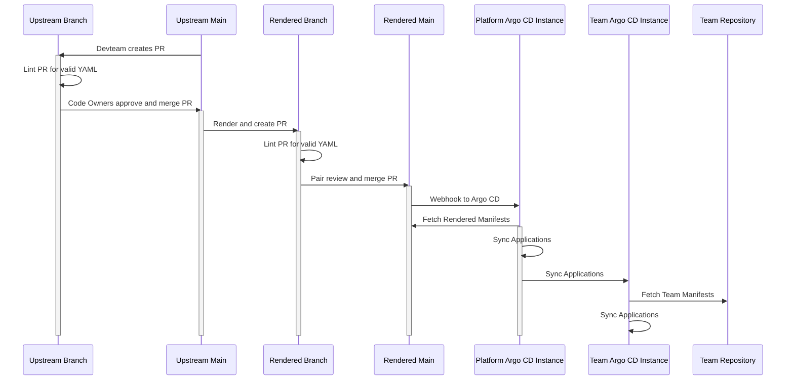

# Flow of Rendered Manifests Pattern

Rather than manifest rendering occurring in the Argo CD instance, it occurs in a separate repository. This repository is updated by a CI pipeline when changes are made to the root repository.

